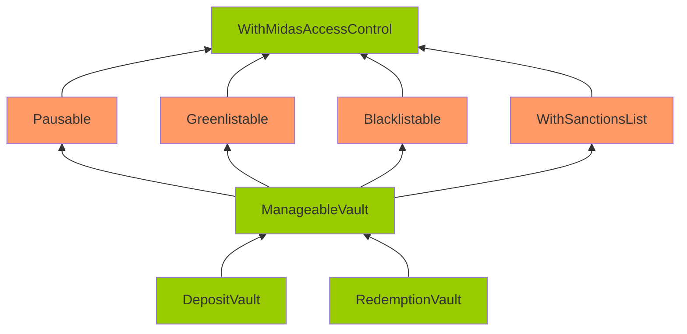

# M-4: Corruptible Upgradability Pattern

## Summary
The report discusses a potential vulnerability in the Midas Minter Redeemer platform. The issue was found by several individuals and involves the storage of vault contracts, which may become corrupted during an upgrade. The report provides a detailed explanation of the vulnerability, including a code snippet and a graph showing the inheritance of the affected contracts. The impact of the vulnerability is also discussed, and a recommendation is made to add gaps to non-pure function contracts to prevent potential misbehavior in the system. This issue was previously reported in a past audit, but has resurfaced due to new contracts and variables being introduced. The report also mentions that the protocol team has fixed the issue in recent commits.

## Details
Source: https://github.com/sherlock-audit/2024-08-midas-minter-redeemer-judging/issues/103 

## Found by 
0xadrii, Hunter, NoOneWinner, WildSniper, aslanbek, eeshenggoh, eeyore, pandasec, pkqs90

## Summary

Storage of vault contracts (e.g. DepositVault, RedemptionVault, ...) contracts might be corrupted during an upgrade.

## Vulnerability Detail

Following is the inheritance of the DepositVault/RedemptionVault contracts.

Note: The contracts highlighted in Orange mean that there are no gap slots defined. The contracts highlighted in Green mean that gap slots have been defined

The vault contracts are meant to be upgradeable. However, it inherits contracts that are not upgrade-safe.

The gap storage has been implemented on the DepositVault/RedemptionVault/ManageableVault/WithMidasAccessControl.

However, no gap storage is implemented on Pausable/Greenlistable/Blacklistable/WithSanctionsList. Among these contracts, Pausable/Greenlistable/WithSanctionsList are contracts with defined variables (non pure-function), and they should have gaps as well.

Without gaps, adding new storage variables to any of these contracts can potentially overwrite the beginning of the storage layout of the child contract, causing critical misbehaviors in the system.

Note that during the last sherlock audit, this was also reported as an [issue](https://github.com/sherlock-audit/2024-05-midas-judging/issues/109). It was fixed by adding gaps to the non-pure contracts. However, since that audit, new contracts and new variables are introduced, so this issue occurs again.

Also, CustomAggregatorV3CompatibleFeed does not have gaps but is inherited by MBasisCustomAggregatorFeed/MTBillCustomAggregatorFeed. If the feed wants to be upgradeable, CustomAggregatorV3CompatibleFeed should also have gaps.

## Impact

Storage of vault contracts might be corrupted during upgrading.

## Code Snippet

- https://github.com/sherlock-audit/2024-08-midas-minter-redeemer/blob/main/midas-contracts/contracts/access/Greenlistable.sol#L22
- https://github.com/sherlock-audit/2024-08-midas-minter-redeemer/blob/main/midas-contracts/contracts/access/Pausable.sol#L14
- https://github.com/sherlock-audit/2024-08-midas-minter-redeemer/blob/main/midas-contracts/contracts/abstract/WithSanctionsList.sol#L18

## Tool used

Manual review

## Recommendation

Add gaps for non pure-function contracts: Pausable/Greenlistable/WithSanctionsList/CustomAggregatorV3CompatibleFeed.

## Discussion

**sherlock-admin2**

1 comment(s) were left on this issue during the judging contest.

**merlinboii** commented:
> Known Issue from the past audit contest and as the past issue there is no gap for several functions and the platform should to fix with the contract that they is decided to more potential to be changes. Assume that it is known issue and sponspor intended to design which contracts that they shoul introduce the gap.

**sherlock-admin2**

The protocol team fixed this issue in the following PRs/commits:
https://github.com/RedDuck-Software/midas-contracts/pull/64
