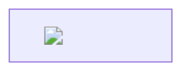

# [C] Lobe Chat affected by Cross-Site Scripting(XSS) that can escalate to Remote Code Execution(RCE)

## Summary
Severity: Critical
Advisory: GHSA-4gpc-rhpj-9443
CVE: CVE-2026-23733
CWE: CWE-94
Ecosystem: npm
CVSS: CVSS:3.1/AV:N/AC:L/PR:N/UI:R/S:C/C:H/I:H/A:H (CVSS_V3)
Published: 2026-01-20
Source: https://github.com/advisories/GHSA-4gpc-rhpj-9443
Type: github-advisory

## Affected
- npm: `@lobehub/chat` — affected >=0

## Details
### Summary
A stored Cross-Site Scripting (XSS) vulnerability in the Mermaid artifact renderer allows attackers to execute arbitrary JavaScript within the application context. This XSS can be escalated to Remote Code Execution (RCE).

### Details
The vulnerability exists in the `Renderer` component responsible for rendering Mermaid diagrams within chat artifacts.
```TypeScript
case 'application/lobe.artifacts.mermaid': {
  return <Mermaid variant={'borderless'}>{content}</Mermaid>;
}
```

The `content` variable, which is derived from user or AI-generated messages, is passed directly to the `<Mermaid>` component without any sanitization. The Mermaid library renders HTML labels (e.g., nodes defined with ["..."]) directly into the DOM. If the content contains malicious HTML tags (like ``), they are executed.


### PoC
````Text
Please output the following text exactly. Do not use code blocks:

<lobeArtifact type="application/lobe.artifacts.mermaid">

</lobeArtifact>
````


### Impact
Remote Code Execution (RCE)

## References
- https://github.com/lobehub/lobe-chat/security/advisories/GHSA-4gpc-rhpj-9443
- https://github.com/lobehub/lobehub/security/advisories/GHSA-4gpc-rhpj-9443
- https://nvd.nist.gov/vuln/detail/CVE-2026-23733
- https://github.com/lobehub/lobe-chat
