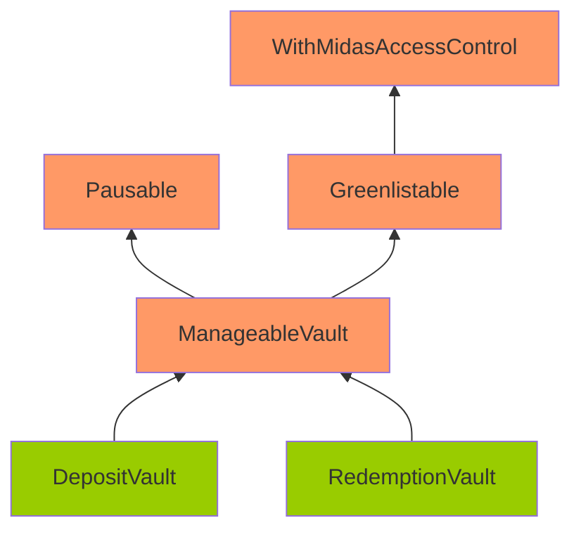
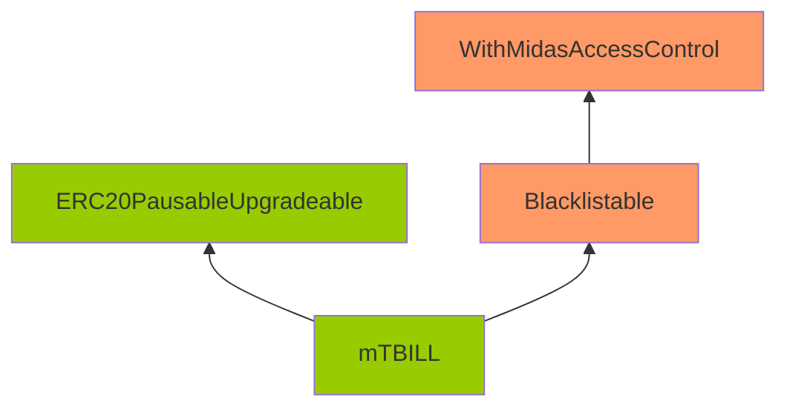

# M-1: Corruptible Upgradability Pattern

## Summary
This bug report is about a potential issue with the Corruptible Upgradability Pattern in the DepositVault/RedemptionVault/mTBILL contracts. The contracts are meant to be upgradeable, but they inherit from contracts that are not upgrade-safe. This means that adding new storage variables could potentially corrupt the system. The report recommends adding gaps for non-pure function contracts to prevent this issue. There was some discussion about the severity of the issue, but it was ultimately classified as a medium severity issue with duplicates. The protocol team has fixed the issue in their code.

## Details
Source: https://github.com/sherlock-audit/2024-05-midas-judging/issues/109 

## Found by 
0xb0k0, 0xjarix, Kalogerone, PNS, ZdravkoHr., charles\_\_cheerful, meltedblocks, nfmelendez, pkqs90, tpiliposian, yovchev\_yoan

## Summary

Storage of DepositVault/RedemptionVault/mTBILL contracts might be corrupted during an upgrade.

## Vulnerability Detail

Following are the inheritance of the DepositVault/RedemptionVault/mTBILL contracts.

Note: The contracts highlighted in Orange mean that there are no gap slots defined. The contracts highlighted in Green mean that gap slots have been defined

The DepositVault/RedemptionVault/mTBILL contracts are meant to be upgradeable. However, it inherits contracts that are not upgrade-safe.

The gap storage has been implemented on the DepositVault/RedemptionVault/mTBILL/ERC20PausableUpgradeable.

However, no gap storage is implemented on ManageableVault/Pausable/Greenlistable/Blacklistable/WithMidasAccessControl. Among these contracts, ManageableVault and WithMidasAccessControl are contracts with defined variables (non pure-function), and they should have gaps as well.

Without gaps, adding new storage variables to any of these contracts can potentially overwrite the beginning of the storage layout of the child contract, causing critical misbehaviors in the system.

## Impact

Storage of DepositVault/RedemptionVault/mTBILL contracts might be corrupted during upgrading.

## Code Snippet

- https://github.com/sherlock-audit/2024-05-midas/blob/main/midas-contracts/contracts/abstract/ManageableVault.sol#L24
- https://github.com/sherlock-audit/2024-05-midas/blob/main/midas-contracts/contracts/access/WithMidasAccessControl.sol#L12

## Tool used

Manual review

## Recommendation

Add gaps for non pure-function contracts: ManageableVault and WithMidasAccessControl.

## Discussion

**0xhsp**

Escalate
This issue is at best low severity, gap storage is not a must to have, no gap storage in ManageableVault / WithMidasAccessControl indicates sponsor won't add new variables to these contracts, even if they have to, they can add new variables in the child contracts.

**sherlock-admin3**

> Escalate
> This issue is at best low severity, gap storage is not a must to have, no gap storage in ManageableVault / WithMidasAccessControl indicates sponsor won't add new variables to these contracts, even if they have to, they can add new variables in the child contracts.

You've created a valid escalation!

To remove the escalation from consideration: Delete your comment.

You may delete or edit your escalation comment anytime before the 48-hour escalation window closes. After that, the escalation becomes final.

**MxAxM**

> Escalate This issue is at best low severity, gap storage is not a must to have, no gap storage in ManageableVault / WithMidasAccessControl indicates sponsor won't add new variables to these contracts, even if they have to, they can add new variables in the child contracts.

This contract is supposed to be upgradeable which means storage gap is required 
Also this issue is considered valid at previous sherlock contests, refer to : https://github.com/sherlock-audit/2022-09-notional-judging/issues/64

according to sherlock docs : if the protocol design has a highly complex and branched set of contract inheritance with storage gaps inconsistently applied throughout and the submission clearly describes the necessity of storage gaps it can be considered a valid medium.

**serial-coder**

> This contract is supposed to be upgradeable which means storage gap is required Also this issue is considered valid at previous sherlock contests, refer to : [sherlock-audit/2022-09-notional-judging#64](https://github.com/sherlock-audit/2022-09-notional-judging/issues/64)

But why my issue (https://github.com/sherlock-audit/2023-06-dinari-judging/issues/110) was rejected in the Dinari contest?

This issue is too subjective, IMO. Would like to see the sponsor's perspective.

**MxAxM**

> > This contract is supposed to be upgradeable which means storage gap is required Also this issue is considered valid at previous sherlock contests, refer to : [sherlock-audit/2022-09-notional-judging#64](https://github.com/sherlock-audit/2022-09-notional-judging/issues/64)
> 
> But why my issue ([sherlock-audit/2023-06-dinari-judging#110](https://github.com/sherlock-audit/2023-06-dinari-judging/issues/110)) was rejected in the Dinari contest?
> 
> This issue is too subjective, IMO. Would like to see the sponsor's perspective.

It's an issue if sponsor wants to upgrade the protocol, it's valid since sponsor didn't list this as a known issue 

according to sherlock docs : if the protocol design has a highly complex and branched set of contract inheritance with storage gaps inconsistently applied throughout and the submission clearly describes the necessity of storage gaps it can be considered a valid medium.

**pronobis4**

This may look planned, but there is no linear/simple inheritance here, just a more convoluted tree where many children inherit from the same contracts, so it will be difficult to make changes if the underlying contracts are not prepared properly.
MEDIUM

**sherlock-admin2**

The protocol team fixed this issue in the following PRs/commits:
https://github.com/RedDuck-Software/midas-contracts/pull/47

**WangSecurity**

I agree with the Lead Judge here. Let's look at the complete rule:

> Use of Storage gaps: Simple contracts with one of the parent contract not implementing storage gaps are considered low/informational.
Exception: However, if the protocol design has a highly complex and branched set of contract inheritance with storage gaps inconsistently applied throughout and the submission clearly describes the necessity of storage gaps it can be considered a valid medium. [Example](https://github.com/sherlock-audit/2022-09-notional-judging/issues/64)

As we see it's not one of the parent contract not implementing storage gaps and the submission clearly explained the necessity of storage gaps here. But, I understand the rule is quite vague, we'll work on it.

Planning to reject the escalation and leave the issue as it is.

**WangSecurity**

Result:
Medium
Has duplicates

**sherlock-admin4**

Escalations have been resolved successfully!

Escalation status:
- [0xhsp](https://github.com/sherlock-audit/2024-05-midas-judging/issues/109/#issuecomment-2155883984): rejected
