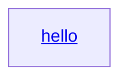

# [H] Remote Code Execution on click of <a> Link in markdown preview

## Summary
Severity: High
Advisory: GHSA-hff8-hjwv-j9q7
CVE: CVE-2024-49362
CWE: CWE-94
Ecosystem: npm
CVSS: CVSS:3.1/AV:L/AC:L/PR:H/UI:R/S:C/C:H/I:H/A:L (CVSS_V3)
Published: 2024-11-14
Source: https://github.com/advisories/GHSA-hff8-hjwv-j9q7
Type: github-advisory

## Affected
- npm: `joplin` — affected >=3.0.0 <3.1.0

## Details
### Summary

There is a vulnerability in `Joplin-desktop` that leads to remote code execution (RCE) when a user clicks on an `<a>` link within untrusted notes. The issue arises due to insufficient sanitization of `<a>` tag attributes introduced by the `Mermaid`. This vulnerability allows the execution of untrusted HTML content within the Electron window, which has full access to Node.js APIs, enabling arbitrary shell command execution.

### Details

In the markdown preview iframe, `Joplin` only opens `<a>` links internally within the same Electron window if they contain the `data-from-md` attribute. While Joplin successfully sanitizes the `data-from-md` attribute in user-embedded `<a>` links from the `.md` file to prevent the execution of untrusted HTML content, it fails to sanitize the `data-from-md` attributes of `<a>` tags introduced by `Mermaid` (e.g., the code snippet shown below). Since `Mermaid` allows the rendering of certain scriptless HTML elements, an attacker can embed `<a> `tags with `data-from-md` attributes, which will then be opened internally in the same Electron window.

Additionally, `Joplin` opens the window with `nodeIntegration` set to `true` and `contextIsolation` set to `false`, resulting in any scripts running in the opened window having full access to Node.js APIs. Furthermore, the markdown preview iframe shares the same origin (i.e.,local file system) as its parent and lacks the `sandbox` attribute, allowing scripts running in the iframe to call Node.js APIs through `window.parent`. As a result, an attacker can execute arbitrary code using Node.js APIs by exploiting HTML files stored on the local file system, which share the same origin as the parent.


**Relevant code references:**

+ Payload to inject `<a>` with `data-from-md` attribute:

````markdown

````

+ Handling link navigation in the markdown preview iframe

https://github.com/laurent22/joplin/blob/e6c09da639adeb76f12e4477cc8442c49c0ced0c/packages/lib/renderers/webviewLib.js#L93-L116

+ Window configuration of `Joplin` window

https://github.com/laurent22/joplin/blob/e6c09da639adeb76f12e4477cc8442c49c0ced0c/packages/app-desktop/ElectronAppWrapper.ts#L141-L155

### PoC

Considering the user has downloaded the following shared files from the internet (Note: the threat model aligns with existing published security issues: [GHSA-2h88-m32f-qh5m](https://github.com/laurent22/joplin/security/advisories/GHSA-2h88-m32f-qh5m) and [GHSA-g8qx-5vcm-3x59](https://github.com/laurent22/joplin/security/advisories/GHSA-g8qx-5vcm-3x59), where the malicious HTML file is available locally):

+ `poc.md`
````markdown

````

+ `poc2.html`
```
<html>
  <body>
    <script>
      if (typeof window.parent.require !== 'undefined') {
        const { exec } = window.parent.require('child_process');
        exec('ls -al', (err, stdout, stderr) => {
          if (err) {
            document.body.innerText = `Error: ${err.message}`;
            return;
          }
          if (stderr) {
            document.body.innerText = `Stderr: ${stderr}`;
            return;
          }
          document.body.innerText = stdout;
        });
      } else {
        document.body.innerText = 'Require is not available in this environment.';
      }
    </script>
  </body>
</html>
```

Then, open the `poc.md` with `Joplin` and click on the `hello` link. The code embedded in the `poc2.html` will be executed.


### Impact

This vulnerability can lead to Remote Code Execution (RCE) when users open and interact with untrusted notes, while malicious HTML files are available locally.

## References
- https://github.com/laurent22/joplin/security/advisories/GHSA-hff8-hjwv-j9q7
- https://nvd.nist.gov/vuln/detail/CVE-2024-49362
- https://github.com/laurent22/joplin
