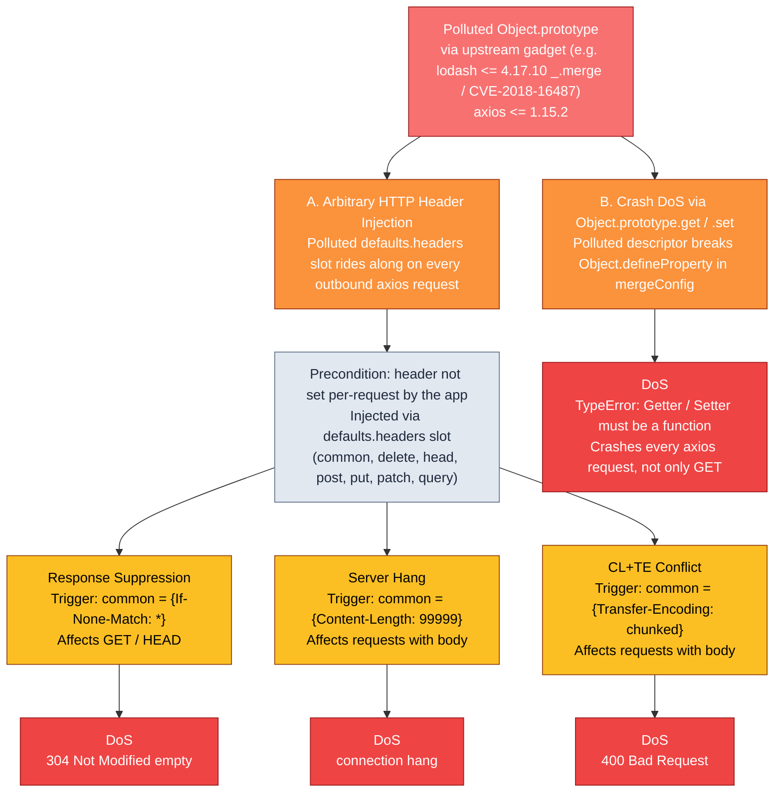

# [M] axios has DoS & Header Injection via Prototype Pollution Read-Side Gadgets in axios merge functions

## Summary
Severity: Medium
Advisory: GHSA-898c-q2cr-xwhg
CVE: CVE-2026-44490
CWE: CWE-1321
Ecosystem: npm
CVSS: CVSS:3.1/AV:N/AC:H/PR:N/UI:N/S:U/C:N/I:L/A:L (CVSS_V3)
Published: 2026-05-29
Source: https://github.com/advisories/GHSA-898c-q2cr-xwhg
Type: github-advisory

## Affected
- npm: `axios` — affected >=1.0.0 <1.16.0
- npm: `axios` — affected >=0 <0.32.0

## Details
## Summary

axios `1.15.2` exposes two read-side prototype-pollution gadgets. When `Object.prototype` is polluted by an upstream dependency in the same process (e.g. lodash `_.merge` / [CVE-2018-16487](https://nvd.nist.gov/vuln/detail/CVE-2018-16487)), axios silently picks up the polluted values:

1. **Header injection** - `lib/utils.js` line 406 builds `merge()`'s accumulator as `result = {}`, so `result[targetKey]` (line 414) walks `Object.prototype` and the polluted bucket's own keys are copied into the merged headers and ride out on the wire.
2. **Crash DoS** - `lib/core/mergeConfig.js` line 26 builds the `hasOwnProperty` descriptor as a plain-object literal. `Object.defineProperty` reads `descriptor.get`/`descriptor.set` via the prototype chain, so a polluted `Object.prototype.get` or `Object.prototype.set` makes the call throw `TypeError` synchronously on every axios request.

## Affected Properties

| Polluted slot | Effect |
|---|---|
| `Object.prototype.common` | injects headers on every method |
| `Object.prototype.delete` / `.head` / `.post` / `.put` / `.patch` / `.query` | injects headers on the matching method |
| `Object.prototype.get` | every axios request throws `TypeError: Getter must be a function` from `mergeConfig.js:26` |
| `Object.prototype.set` | every axios request throws `TypeError: Setter must be a function` from `mergeConfig.js:26` |

Per-request headers (`axios.request(url, { headers: {...} })`) overwrite polluted entries. Polluting `Object.prototype.get` triggers the crash before any header is built.

## Proof of Concept

```javascript
const axios = require('axios');

// Finding A - header injection
Object.prototype.common = { 'X-Poisoned': 'yes' };
await axios.get('http://api.example.com/users');
// Wire request carries `X-Poisoned: yes`.

// Finding B - crash DoS
Object.prototype.get = { something: 'anything' };
await axios.get('http://api.example.com/users');
// TypeError: Getter must be a function: #<Object>
//     at Function.defineProperty (<anonymous>)
//     at mergeConfig (lib/core/mergeConfig.js:26:10)
```

## Impact

- **Server hang** (`Content-Length: 99999`): receiver waits for a body that never arrives. Affects requests with a body.
- **CL+TE conflict** (`Transfer-Encoding: chunked` rides alongside axios's auto `Content-Length`): receiver rejects with `400 Bad Request`. Affects requests with a body.
- **Response suppression** (`If-None-Match: *`): receiver returns empty `304 Not Modified`. Affects GET / HEAD.
- **Crash DoS** (`Object.prototype.get` / `.set`): every axios request fails synchronously with `TypeError`, not `AxiosError`, so handlers filtering on `error.isAxiosError` mishandle the failure.

## Attack Flow



## Root Cause

**Finding A.** `lib/utils.js:404-429`'s `merge()` creates `result = {}` at line 406. The dangerous-keys filter on lines 408-411 blocks the write side, but the read at line 414 (`isPlainObject(result[targetKey])`) still walks the prototype chain. When `targetKey` matches a polluted slot, `result[targetKey]` returns the polluted nested object, and the recursive `merge(result[targetKey], val)` on line 415 iterates that object's own keys via `forEach` and copies them as own properties into the new accumulator. Those keys flow through `mergeConfig.js:35` → `Axios.js:148` (`utils.merge(headers.common, headers[config.method])`) → `Axios.js:155` (`AxiosHeaders.concat(...)`) → onto the wire via `http.js:677` (`headers: headers.toJSON()`) → `http.js:767` (`transport.request(options, ...)`).

**Finding B.** `lib/core/mergeConfig.js:25` correctly makes `config = Object.create(null)`, but the descriptor passed on line 26 is a plain-object literal - its `get`/`set` lookups walk `Object.prototype`. A polluted non-function `Object.prototype.get` or `.set` makes `Object.defineProperty` throw `TypeError: Getter must be a function` (or `Setter must be a function`) before the call returns. The descriptor is built unconditionally on every `mergeConfig` invocation, so every axios request throws - POST, PUT, DELETE, PATCH, HEAD, QUERY, not only GET.

## Suggested Fix

Use null-prototype objects in place of the plain-object literals at `lib/utils.js:406` and `lib/core/mergeConfig.js:26-31`. The same descriptor pattern recurs at `lib/core/AxiosError.js:37`, `lib/core/AxiosHeaders.js:100`, `lib/utils.js:447/454/492/498`, and `lib/adapters/adapters.js:28/32`.

## Resources

- [CVE-2018-16487](https://nvd.nist.gov/vuln/detail/CVE-2018-16487) - `lodash.merge` prototype pollution in `lodash <= 4.17.10`
- [CWE-1321](https://cwe.mitre.org/data/definitions/1321.html) - Improperly Controlled Modification of Object Prototype Attributes

## References
- https://github.com/axios/axios/security/advisories/GHSA-898c-q2cr-xwhg
- https://nvd.nist.gov/vuln/detail/CVE-2018-16487
- https://nvd.nist.gov/vuln/detail/CVE-2026-44490
- https://github.com/axios/axios
