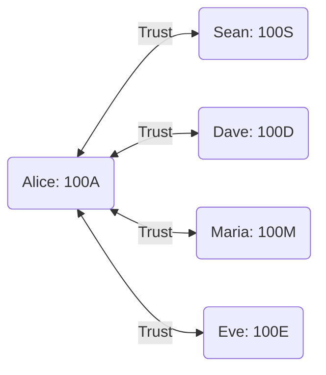
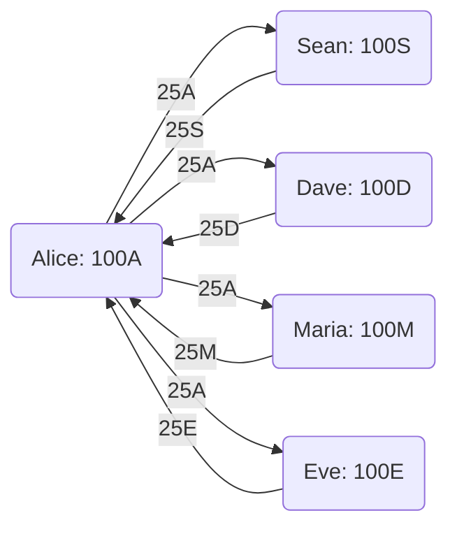
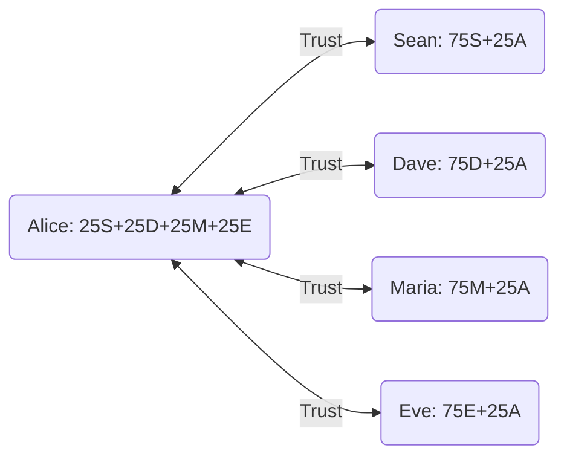
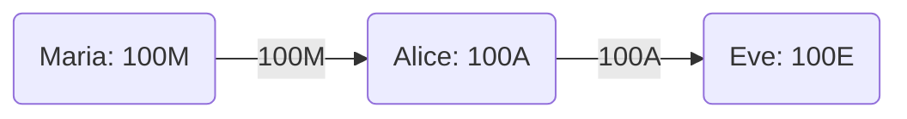
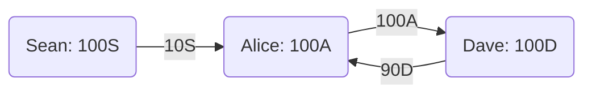
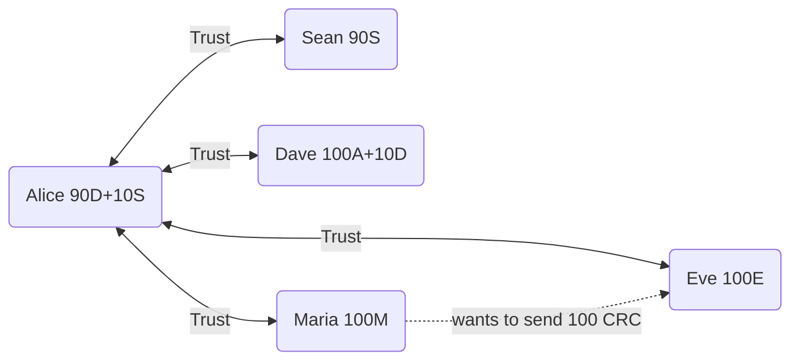

# [M] Always-Approved Net-Zero Value Flows Can Block Normal Flow Matrix Operations

## Summary
Severity: Medium
Chain: Smart contract
Component: Circles
Published: 2024-09-19
Source: https://github.com/hats-finance/Circles-0x6ca9ca24d78af44582951825bef9eadcb210e5cf/issues/122
Type: hats-finding

## Details
**Github username:** @hxaro
**Twitter username:** --
**Submission hash (on-chain):** 0xbd7c26ae4f2064388b6964def5cdafd2ea51ac76d1f069281637c99568b97cb3
**Severity:** medium

**Description:**
## Description

In the operateFlowMatrix function only the net-senders of the provided streams are required to have approved the operator executing a flow matrix. First, this implies that if a flow matrix has no streams, then no vertex needs to have approved the operator for the operator to be able to touch any of the balances across the network (as described in the docs) - under the condition that the remaining constraints of `operateFlowMatrix` are satisfied, ie. net transfers are zero, and all trust relations are respected and all balances are there to be transferred. Note that it is not about requiring at least one stream, as an attacker can always add a trivial transfer as a stream, and still touch any of the balances across the graph under the constraints of the Circles protocol.

In effect the looser constraint for only checking the stream senders ([see LL552-560 of Hub.sol](https://github.com/aboutcircles/circles-contracts-v2/blob/rc-v0.3.6-alpha/src/hub/Hub.sol#L552-L560))

```js
function operateFlowMatrix() {
    ...
    // check all senders have the operator authorized
    for (uint16 i = 0; i < _streams.length; i++) {
        if (!isApprovedForAll(_flowVertices[_streams[i].sourceCoordinate], msg.sender)) {
            // Operator not approved for source.
            revert CirclesHubOperatorNotApprovedForSource(
                msg.sender, _flowVertices[_streams[i].sourceCoordinate], i, 0
            );
        }
    }
```
implies that **all Circles avatars** have "authorized all addresses as ERC1155 operators, under the additional rules of Circles _trust path fungibility_. We understand that this is the core principle of Circles, and have not seen an issue with the implementation of this in `operateFlowMatrix`. Our concern in this issue, however, relates to an attacker wanting to prevent the normal intended use of operators calling `operateFlowMatrix` to settle transfers of users.

We imagine that if attackers exist that are intent on blocking the functioning of Circles path transfers they can easily disrupt genuine path transfers, causing them to fail with high likelihood, relative to the effort for genuine operators to construct valid paths for streams and the gas-grievence these honest operators incur when their paths are invalidated by an attacker front-running their transaction with fairly generic reshufflings of the graph state. We will detail at least one such strategy for an attacker below.

## Impact

The negative impact of the liberty to reshuffle tokens at will by anyone with net-zero value transfers can be seen as two attack vectors:

1. Implementing a **race condition**:
If the trivially-approved transaction sufficiently disperses tokens, it can cause later transactions, i.e. calls to `operateFlowMatrix`, to fail, costing the users gas. Targeting central vertices, as measured for example by a high [betweenness centrality](https://en.wikipedia.org/wiki/Betweenness_centrality) value, would be an effective way of disrupting the flow of tokens through paths that are likely to be shorter. This is because vertices with high centrality are a necessary component for a large number of shortest paths between any through vertices on the graph/network. Thus this kind of attack can be done in a DDOS-like manner, disrupting the functioning of the network in an undirected manner.
In particular if an attacker wants to target a specific community, they can target to disperse maximally the tokens of the highest centrality members (vertices) by front-running the settlements of that community with such easily computed path-transfers, without needing to closely inspect the actual upcoming streams settlements, as the attacker only needs to get one condition of insufficient balance to trigger the reversal of the whole community settlement - and for their operator to restart.

2. Increasing the required path length for later transactions, thus **increasing gas costs**:
We consider an example in the Proof of Concept where a single extra transfer along an already-used path requires two transfers to be reversed for another legitimate path transfer to take place; this increases the gas cost disproportionately for the latter transaction.
More generally, an operator can push “central” tokens, i.e tokens of high centrality vertices, into peripheral nodes in an attempt to **sever shortest paths** in the network. This is also illustrated in the example below.


## Proof of Concept

We demonstrate this with an extended example:

### A DDOS-like Dispersion Example

Consider the following trust-network motif adapted from the [version 1 whitepaper](https://github.com/CirclesUBI/whitepaper/) where each user has a balance of 100 of its own tokens:



[](https://mermaid.live/edit#pako:eNptkVFrgzAUhf-K3CcLKjqTVsMYFPRtvsw9jbxcTLbKalKyuK0T__ti6mDQ5uEQvnNyD0km6LSQwOD1qL-6AxobPD5xFbi1P_adDL2yIEvT_ebCW4kqXMTTdqUVfspwEU-rlTZoegy9et6svHbhes3Wm399wX0cP5vxw8bxg2_iittrZym67fiu25YrhAgGaQbshbvytPRysAc5SA7MbQWadw5czS6Ho9XtWXXArBllBONJoJVVj28Ghz94QgVsgm9gGcmTMiW7gmZ0e0cjOAPL6TYpab5LSZHnZUHIHMGP1u50mriEFL3Vprm8v_8GP_DFJ5b58y97bXwP)

(`Alice: 100A` meaning Alice has a balance of 100 Alice tokens, `Sean: 100S` Sean has a balance of 100 Sean tokens, and so on)

A blind DDOS-like attack could be implemented with the following net-zero transfers:


[](https://mermaid.live/edit#pako:eNpt0UFrgzAYBuC_It_JghWt2moOA8Hc5mXeRi5Bs1VWkxLitk7970tiOmTUw4c8vH5vMBO0omOA4O0ivtozlcp7fiHc00956Vvm24m8OIrK3eoNo9w3w2rjtKKfzDfDauW0prKnvp3Wa-dYh7HL4t2mz9vvn-ZDVs62hnCi_rGpeMC24oFjk76f2nEzr10mbtY5rjZs1zmvN47_0tgpBDAwOdC-0z9xMl0E1JkNjADSrx2VHwQIX3SOjko0N94CUnJkAYzXjipW9fRd0uGOV8oBTfANKE6TsIjSU57F2fGQBXADlGTHsMiSU5TmSVLkaboE8COE_joKdYJ1vRKyXm_UXqxd-GoTZv_yC0bdlVU)

(`25A` on the edge beween Alice and Sean meaning 25 Alice tokens are moved from Alice to Sean, etc.)

resulting in the following state of the network: 


[](https://mermaid.live/edit#pako:eNptkUFrhDAQhf-KzMlSFVfNqqEUFvRWL7Wnksug2a5UzZKNbbfif28SexB2A_MI873JC8kMjWg5UDj24rs5oVTOyysbHb0Ofddw1yp1IlI_RqTQVekqH1ZLzXF0jVAntYbDPyjwi7tGDCg2oELZoWvVoGqDSj1SrhPlpm0v4Dz5_pucLsr3n20qG5m6JSbxPrGJ95HOBA8GLgfsWv0Ss8lloE584Ayo3rYoPxmwcdE-nJSor2MDVMmJezCdW1S86PBD4gD0iP1Fd884Ap3hB-guiYM8TNKM7Mg-Ih5cgcZkH-QkTsMki-M8S5LFg18h9HgYaAdvOyVktf6L_R574Lt1mNTlDwsLgYY)

This example token shuffling would prevent transfers of above 25CRC between members of this community but it is trivially approved because of the absence of streams.

### An Extended Example

In this example, the attacker can bootstrap a legitimate transfer that costs more gas to reverse in a later transaction. Considering againg the original state of the same trust motif:


[](https://mermaid.live/edit#pako:eNptkUFrhDAQhf-KzMlSFVfNqqEUFvRWL7Wnksug2a5UzZKNbbfif28SexB2A_MI873JC8kMjWg5UDj24rs5oVTOyysbHb0Ofddw1yp1IlI_RqTQVekqH1ZLzXF0jVAntYbDPyjwi7tGDCg2oELZoWvVoGqDSj1SrhPlpm0v4Dz5_pucLsr3n20qG5m6JSbxPrGJ95HOBA8GLgfsWv0Ss8lloE584Ayo3rYoPxmwcdE-nJSor2MDVMmJezCdW1S86PBD4gD0iP1Fd884Ap3hB-guiYM8TNKM7Mg-Ih5cgcZkH-QkTsMki-M8S5LFg18h9HgYaAdvOyVktf6L_R574Lt1mNTlDwsLgYY)

We imagine the case that Maria wants to send 100CRC to Eve. This would be trivial under the original conditions:



[](https://mermaid.live/edit#pako:eNpNkMFuhCAQhl_FzMkmrsECu8qhiUn3Vi_treEyEbZLqrKh2HarvnsR22RJmJCPb37ITNBapUHAqbNf7RmdT56e5ZCEVXem1WmsIikIqe823qAzmMYaefPHj586DTuy462b7HYP8yrOW-ZN_P9VPa_tkEGvXY9GhQ9NqybBn3WvJYhwVOjeJchhCR6O3r5chxaEd6POYLwo9PrR4JvDHsQJu49ALziAmOAbRMFoXhF2KHnB9_c8gysIyvd5xemBsJLSqmRsyeDH2tBO8mBoZbx1zTaeOKUY-BqN9dXlF562XXI)
(for clarity we are here only showing the relevant part of this group and omitting Sean and Dave and their respective trust connections and balances)

However, imagine that we first have the following transfer implemented by an operator trusted by Sean but not by Alice. The net flow of 10CRC intended by Sean is implemented but extra tokens are moved between Alice and Dave, effectively redirecting all of the tokens of the high centrality vertex, i.e. Alice and Alice's tokens, to Dave:



[](https://mermaid.live/edit#pako:eNotkE1vgzAMhv8K8olKFIWRtJDDJCSO22XcplwskrZoQKo0bOuA_74k4MNr69HrD3mGVksFHC69_mlvaGz09iHGyEXVd62Kg_IoI6Q6bLxROMZeAm12WuO3ir0EWjsqrDdFx-PrkpFm2eZ5HIqdk2oJrZ77HHBJ6t0OCQzKDNhJd-LsNwmwNzUoAdyVEs2XADGuzoeT1c1zbIFbM6kEprtEq-oOrwYH4BfsH47ecQQ-wy_wjOZpSei5YBk7vbAEnsBzdkpLlp8JLfK8LChdE_jT2rWT1DmU7Kw279vDwt_CwM_g8FvXf3xwZVk)
(again only showing the relevant part of this trust network motif to this step)


We then have the following state arise:



[](https://mermaid.live/edit#pako:eNptUc9vgjAU_lead2IZkDJApVlMjHAbF91p4fICdZJJa0qZc-j_vrboTvbwpfl-9HvpG6GWDQcGu4M81XtUmrxtKkHMWR3amnsOSUbz54hunyZly1F4Fgx_53L85p4FElG6Mub8JpSoWvQcWqm80YWxF5O7MFSlp6LXIHhXQ6-DYOlqHiu257Hieh5Lhc38T0SCMFheTih0T7QkPReNnYWsN-uLtYIPHVcdto35nNEGK9B73vEKmLk2qL4qqMTV-HDQcnsWNTCtBu7DcGxQ87zFT4UdsB0eesMeUQAb4QdYlMRhRpP5Io3S2UvqwxlYnM7CLI3nNFnEcbZIkqsPv1KaOA2NgzetlqqcVuU25h78cA7bev0Db9uJ3A)
(the dashed line is for illustration of the intention of Maria to send tokens only and it doesn't represent any further concept)

Now there is no path from Maria to Eve that can fulfill the 100CRC transfer. If the Sean->Dave transfer is implemented at the 'wrong time', it could create a race condition which would interrupt the subsequent Maria->Eve transaction.

Indeed, *no net transfer needs to happen* to interrupt the next transaction: a malicious actor, upon suspecting a pending Maria->Eve transaction, could simply disperse Alice tokens amongst Alice's other neighbors (or the subset of neighbors that are at a further distance from Eve and Maria, within a larger network) in exchange for their various tokens, and the Maria->Eve transaction would be blocked.

Crucially, in order for the next Maria->Eve transfer to be fulfilled, an operator would have to reverse Alice tokens back to Alice (or find a longer, more expensive path, within a larger network). We note that it would take an extra two transfers to enable the Maria->Eve transfer, even though it took one extra transfer to disrupt it.

## Recommendation

In the ideal case one would like to check for the necessity of net-zero flows to fulfill streams instead of allowing any and all net-zero flows in the network, blocking the cases when such net-zero flows are not necessary to fulfill a stream. This is however non-trivial and most likely unimplementable at the smart contract level given computational constraints of the EVM. Blocking all net-zero flows is undesireable because: 1) they are necessary for proper protocol functioning and 2) one can add a trivial transaction while still disrupting the flow in the process as illustrated by the extended example.

An alternative would entail adding the ability to approve only certain operators.
