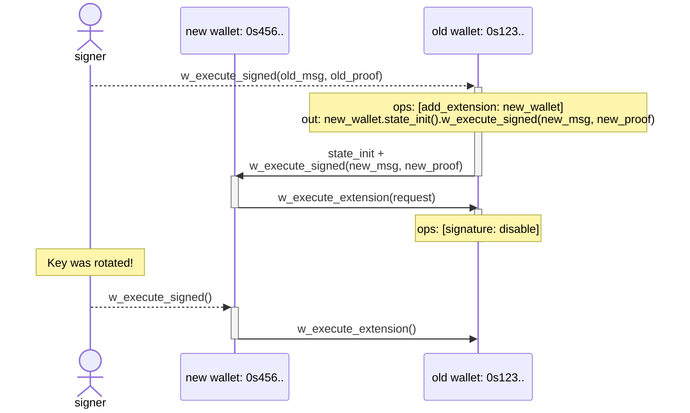

No vulnerability found for this question.

**Reasoning:** The behavior described is intentional, documented design, not a broken authorization guard.

The wallet's `execute_op` dispatches `WalletOp::AddExtension` identically regardless of whether the caller reached it via `execute_signed` (owner-authorized) or `execute_extension` (already-enabled-extension-authorized) [1](#0-0) . The `add_extension` function itself has no additional gate beyond "not already enabled" [2](#0-1) .

However, the wallet contract's own specification states that enabled extensions are explicitly granted the same authority as the owner, including the power to add or remove further extensions: *"Extensions... have full control over the wallet-contract instance and can be added/removed by the signer or other installed extensions"* and *"Extensions... have the same full power over the wallet-contract instance as the original signer does. Extensions can be added or removed by the signer or other installed extensions."* [3](#0-2) [4](#0-3) 

The key-rotation example flow in the README explicitly relies on this exact mechanic — an owner-signed `w_execute_signed` request adds a new extension, and that new extension later calls `w_execute_extension` to further mutate wallet state (disable signature) without a fresh owner signature over that specific op [5](#0-4) .

Critically, the attack in the question requires the owner to have *already* signed a `w_execute_signed` message enabling `E1` as an extension in the first place — this is a precondition the attacker cannot manufacture unilaterally under the stated attacker profile (no victim private key, not a role holder). Once the owner grants extension status to `E1` via their own signature, the spec defines that grant as conferring full, transitive, owner-equivalent control — including the ability for `E1` to enroll further co-equal extensions. That is not an "unauthorized third party" gaining access; it's the direct, documented consequence of the owner's own signed action. The claimed binding ("every extension enabled == one the owner signed for") does not match the contract's actual authorization model, which is "every *first* extension is one the owner signed for; any extension can subsequently add further extensions by design." [6](#0-5)

### Citations

**File:** contracts/wallet/src/contract.rs (L208-222)
```rust
    fn execute_extension(&mut self, request: Request) -> Result<()> {
        if env::attached_deposit().is_zero() {
            return Err(Error::InsufficientDeposit);
        }

        // check whether extension is enabled
        let extension_id = env::predecessor_account_id();
        self.check_extension_enabled(&extension_id)?;

        // maybe cleanup nonces from the storage as best-effort to make it
        // available for further applying wallet-ops below
        self.0.nonces.check_cleanup();

        self.execute_request(request, &Actor::Extension(extension_id.into()))
    }
```

**File:** contracts/wallet/src/contract.rs (L236-242)
```rust
    fn execute_op(&mut self, op: WalletOp, actor: Actor<'_>) -> Result<()> {
        match op {
            WalletOp::SetSignatureMode { enable } => self.set_signature_mode(enable, actor),
            WalletOp::AddExtension { account_id } => self.add_extension(account_id, actor),
            WalletOp::RemoveExtension { account_id } => self.remove_extension(&account_id, actor),
        }
    }
```

**File:** contracts/wallet/src/contract.rs (L260-272)
```rust
    fn add_extension(&mut self, account_id: AccountId, actor: Actor<'_>) -> Result<()> {
        if !self.0.extensions.insert(account_id.clone()) {
            return Err(Error::ExtensionEnabled(account_id));
        }

        WalletEvent::ExtensionAdded {
            account_id: account_id.into(),
            by: actor,
        }
        .emit();

        Ok(())
    }
```

**File:** contracts/wallet/README.md (L12-16)
```markdown
* [**Extensions**](#extensions) can be implemented as *separate* third-party
  accounts/contracts on Near with their own arbitrary logic. Installed
  extensions have full control over the wallet-contract instance and can be
  added/removed by the signer or other installed extensions. Enables 2FA, social
  recovery and more.
```

**File:** contracts/wallet/README.md (L64-67)
```markdown
Extensions are **separate** third-party accounts/contracts on Near that can
execute arbitrary requests on behalf of the wallet and have the same full power
over the wallet-contract instance as the original signer does. Extensions can be
added or removed by the signer or other installed extensions.
```

**File:** contracts/wallet/README.md (L172-205)
```markdown
To rotate a key for the original wallet, the signer needs to:

1. Create a new keypair
1. Derive a new wallet address from the new public key
1. Prepare a request for the new wallet that calls `w_execute_extension()` method
   on the old wallet and disables signature on it, and sign it by the new key.
1. Prepare another request for the old wallet that adds the new wallet as an
   extension, initializes its state and calls `w_execute_signed()` method on it,
   passing there the request and the corresponding proof from the previous step.
1. Sign the nested request by the old key and relay it to the old wallet.

As a result, signer can now sign by the new key extension requests to the old
wallet, while having a full control over the original address.


```
