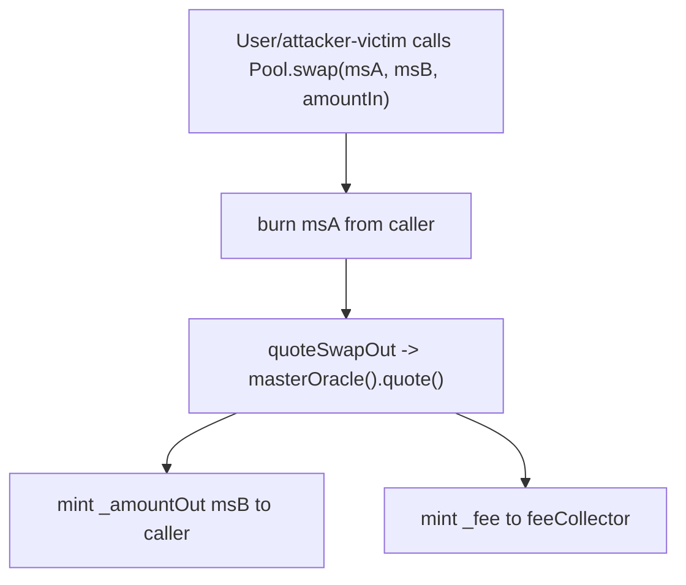

### Title
Missing minimum output amount in `Pool.swap` oracle-priced synthetic token swaps - ([File: contracts/Pool.sol])

### Summary
`Pool.swap` lets any caller burn one synthetic token and mint another at a price derived entirely from `masterOracle().quote(...)` inside the same transaction, but it accepts no `minAmountOut` parameter and performs no slippage check. This is the same bug class as the SEuroOffering `swap()`/`swapETH()` finding: the exchange rate is resolved at execution time by an oracle call the user cannot bound, so the caller can receive less `syntheticTokenOut_` than they expected when they signed the transaction.

### Finding Description
`Pool.swap` at `contracts/Pool.sol:642-671` takes only `(syntheticTokenIn_, syntheticTokenOut_, amountIn_)`. It burns `amountIn_` of the input synth (line 660), computes the output via `quoteSwapOut` (line 662), which calls `masterOracle().quote(syntheticTokenIn_, syntheticTokenOut_, amountIn_)` and deducts `feeProvider.swapFees(...)` (lines 512-525), then mints whatever `_amountOut` comes back (line 668). A grep over the entire repo confirms there is no `minAmountOut`/`amountOutMinimum`/equivalent bound anywhere in production code.

The user-side "quote then swap" pattern is unsafe: `quoteSwapOut` is a `view` function, so any UI or contract that reads it and then submits `swap` has no on-chain guarantee the price hasn't moved between the two transactions. An unprivileged attacker can exploit this whenever the oracle path is manipulable within a transaction (e.g., oracle feeds that read on-chain vault-share/AMM-derived rates for collateral or synth pricing — the prompt's allowed "same-transaction manipulation" case), or simply when a legitimate oracle update lands between quote and execution, which is precisely the "accidental price change" the source report flags.

Call flow:



### Impact Explanation
Direct loss of user funds: the victim's input synth is burned unconditionally before the output is computed, and the amount minted back is whatever the oracle returns at execution time. If the effective price is worse than expected, the value difference is a permanent loss — the minted synths are fully backed claims on the protocol, so value simply transfers from the swappers to the rest of the system. There is no revert path for a bad fill.

### Likelihood Explanation
Reachable by any EOA holding synthetic tokens: `swap` is guarded only by `whenNotShutdown`, `nonReentrant`, `onlyIfSyntheticTokenExists` and `isSwapActive` — none of which bound the output. Exploitation requires either (a) same-transaction oracle price manipulation via an AMM/vault-share-based feed (allowed attacker capability), or (b) front-running a victim's swap around an oracle update. The absence of a slippage parameter makes even non-adversarial price drift a guaranteed loss rather than a revert. Likelihood is moderate — it depends on oracle feed manipulability — but the missing-check itself is unconditional.

### Recommendation
Add a `minAmountOut_` (and optionally a deadline) parameter to `Pool.swap`/`IPool.swap`, and revert if `quoteSwapOut`'s result is below it:

```solidity
// contracts/Pool.sol
function swap(
    ISyntheticToken syntheticTokenIn_,
    ISyntheticToken syntheticTokenOut_,
    uint256 amountIn_,
    uint256 minAmountOut_
) external ... returns (uint256 _amountOut, uint256 _fee) {
    ...
    (_amountOut, _fee) = quoteSwapOut(syntheticTokenIn_, syntheticTokenOut_, amountIn_);
    if (_amountOut < minAmountOut_) revert AmountOutTooLow();
    ...
}
```

Callers in `SmartFarmingManager` leverage/flashRepay paths that route through `swap` should forward a user-supplied bound as well.

### Proof of Concept
Hardhat fork-style PoC sketch:

```ts
// Setup: pool, msTokenIn, msTokenOut active; isSwapActive = true; victim holds amountIn of msTokenIn.
const quoted = await pool.quoteSwapOut(msIn.address, msOut.address, amountIn);

// Attacker (unprivileged) manipulates the oracle-priced path in the same block
// before victim's tx executes — e.g., a large AMM trade / donation that moves
// the feed backing masterOracle().quote(msIn -> msOut), worsening the rate.
// (With a manipulable feed this is one bundle; with a regular feed update the
// attacker simply back-runs the update ahead of the victim tx.)

const balBefore = await msOut.balanceOf(victim.address);
await pool.connect(victim).swap(msIn.address, msOut.address, amountIn); // no minOut arg exists
const balAfter = await msOut.balanceOf(victim.address);

// Victim's msIn was burned; they received materially less than `quoted._amountOut`
// and there is no parameter they could have set to revert instead.
expect(balAfter.sub(balBefore)).to.be.lt(quoted._amountOut);
```

Caveat: the concrete manipulation leg depends on the deployed `MasterOracle` implementation, which is not in the indexed sources (only `IMasterOracle` and `MasterOracleMock` are present), so the exact price-move step must be validated against the live oracle configuration on a fork. The missing-slippage-check defect itself is fully confirmed in `contracts/Pool.sol:642-671` and `contracts/interfaces/IPool.sol:100-104`.