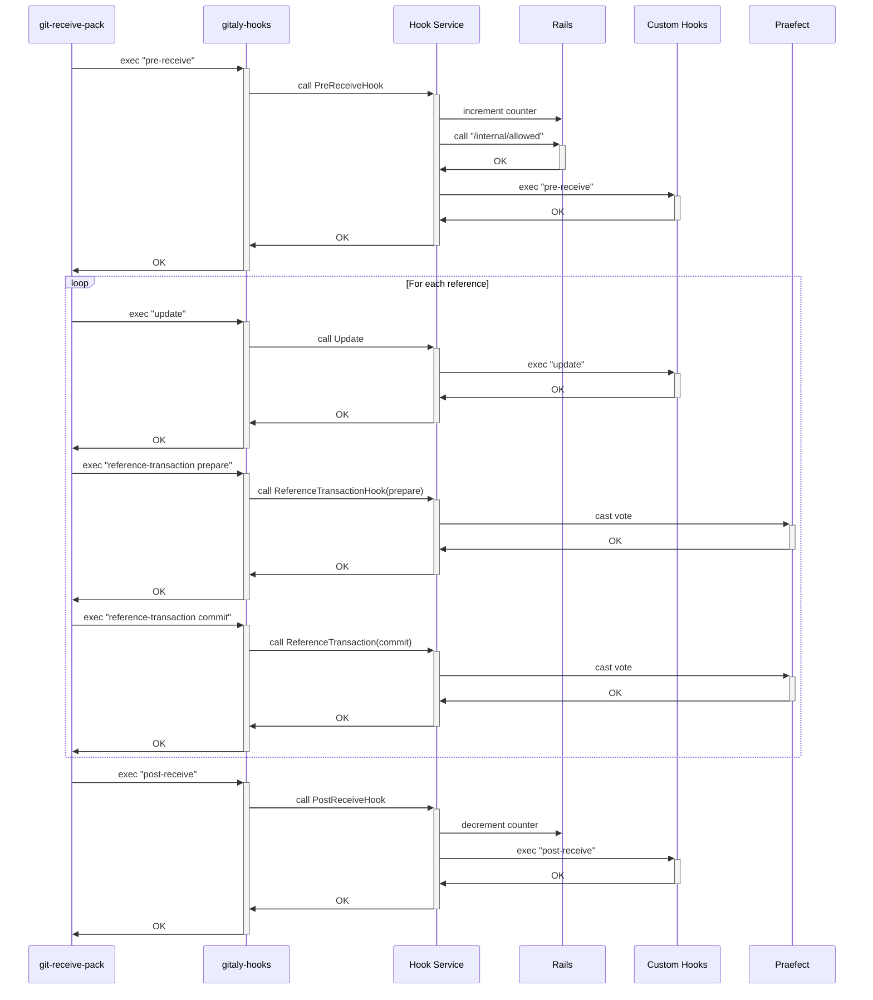

### Title
Reference counter leaked on Rails when `pre-receive` succeeds but `post-receive` is never invoked due to a subsequent Gitaly-side failure - (File: internal/gitaly/hook/prereceive.go, internal/gitaly/hook/postreceive.go)

### Summary
The `deposit`/`withdraw` asymmetry described in the report (a tracker is incremented on one path but the corresponding decrement is skipped on an error/alternate path) maps to Gitaly's push-tracking "reference counter" maintained by Rails via the `pre_receive`/`post_receive` internal API calls. `GitLabHookManager.preReceiveHook` calls `m.gitlabClient.PreReceive` which increments the counter [1](#0-0) , and the matching decrement happens only inside `postReceiveHook` via `m.gitlabClient.PostReceive` [2](#0-1) .

### Finding Description
`PreReceiveHook` increments the reference counter as the last step of a successful pre-receive Allowed()/custom-hook sequence [3](#0-2) . Documentation confirms the counter's purpose and lifecycle: incremented in pre-receive, decremented in post-receive, and used by GitLab to know when "there are active pushes happening" and hence to gate whether a repository can be moved [4](#0-3) .

Between the increment and the decrement, Git and Gitaly execute several more steps that can fail on the primary node: the `update` hook, the `reference-transaction` prepare/commit voting round, and finally `post-receive` itself [5](#0-4) . If any of these intermediate steps fails or the RPC context is cancelled/times out before `git-receive-pack` invokes the `post-receive` hook (e.g., `update` hook rejection, reference-transaction quorum failure, RPC deadline exceeded, client disconnect, or the primary process crashing), `GitLabHookManager.PostReceiveHook` — and therefore `m.gitlabClient.PostReceive` — never executes for that push. There is no compensating decrement anywhere else in Gitaly for a counter that was already incremented; unlike `Bribe.sol`'s `withdraw`, which is simply missing the decrement in an otherwise-called function, here the decrement is embedded in a hook stage (`post-receive`) that is not unconditionally guaranteed to run once `pre-receive` has already committed its side effect on the remote counter.

This is reachable purely from an ordinary user's authenticated `git push` (via `PostReceivePack`/`SSHReceivePack`/`OperationService` RPCs that invoke `updateref.UpdaterWithHooks`), matching the "ordinary user's push" trigger required for a valid analog.

### Impact Explanation
If the Rails-side reference counter is left permanently incremented, GitLab believes the repository has an "active push" indefinitely. Per the documented semantics, this is explicitly used to prevent repository moves/relocation while a push is in flight [6](#0-5) . A stuck non-zero counter would therefore block legitimate repository storage moves/housekeeping indefinitely for that project — a persistent, user-triggerable denial-of-service against repository migration operations, without requiring any privileged access, leaked token, or malicious peer.

### Likelihood Explanation
The precondition (successful pre-receive access check and counter increment, followed by failure before post-receive executes) is achievable by an ordinary authenticated user causing `update` hook rejections, reference-transaction/quorum failures, or by timing out/cancelling a push after the pre-receive stage but before post-receive. Because these failure points are common and does not require any special privilege on the Gitaly side (Gitaly always calls `PreReceive` before it is guaranteed to reach `PostReceive`), likelihood is at least moderate. However, the actual persistence of the leak depends on Rails-side counter semantics/idempotency (e.g., whether it self-heals via periodic reconciliation) which is outside Gitaly's codebase and could not be verified from this repository.

### Recommendation
Ensure the pre-receive reference-counter increment is always paired with a decrement regardless of how the push terminates on the primary node. Concretely:
- In `GitLabHookManager.PreReceiveHook`/`preReceiveHook`, register a `defer` (guarded by whether the increment call succeeded) that unconditionally invokes the Rails decrement (`PostReceive`'s counter-decrement semantics or a dedicated cleanup endpoint) if the subsequent `update`/reference-transaction/`post-receive` stage does not run to completion.
- Alternatively, ensure `stopTransaction` paths (called on `pre-receive`/`update`/reference-transaction failures, see `internal/gitaly/hook/prereceive.go` and `internal/gitaly/hook/postreceive.go` `stopTransaction` calls) also trigger the counter decrement before returning the error, so that any code path exiting after the increment always converges on a decrement call.

### Proof of Concept
Not independently reproducible from static analysis alone since the counter itself lives in Rails, not in this repository; verification would require an integration/e2e test against a GitLab Rails instance:
1. Push a change that passes the `/internal/allowed` access check and increments the counter via `m.gitlabClient.PreReceive` (`internal/gitaly/hook/prereceive.go:197-205`).
2. Cause the `update` hook or reference-transaction stage to fail (e.g., by configuring a custom `update` hook that always exits non-zero) so that `git-receive-pack` never invokes `post-receive`.
3. Observe on the Rails side that the reference counter for the repository remains non-zero after the push completes with an error, and that this blocks subsequent repository-move operations gated on that counter.

This mirrors the external report's PoC pattern (`deposit`/increment executes, matching `withdraw`/decrement does not), but note the exact counter-persistence behavior on the Rails side could not be confirmed from the Gitaly codebase alone.

### Citations

**File:** internal/gitaly/hook/prereceive.go (L176-205)
```go
	executor, err := m.newCustomHooksExecutor(ctx, repo, "pre-receive")
	if err != nil {
		return fmt.Errorf("creating custom hooks executor: %w", err)
	}

	customEnv, err := m.customHooksEnv(ctx, payload, pushOptions, envs)
	if err != nil {
		return structerr.NewInternal("constructing custom hook environment: %w", err)
	}

	if err = executor(
		ctx,
		nil,
		customEnv,
		bytes.NewReader(changes),
		stdout,
		stderr,
	); err != nil {
		return fmt.Errorf("executing custom hooks: %w", err)
	}

	// reference counter
	ok, err := m.gitlabClient.PreReceive(ctx, repo.GetGlRepository())
	if err != nil {
		return structerr.NewInternal("calling pre_receive endpoint: %w", err)
	}

	if !ok {
		return errors.New("")
	}
```

**File:** internal/gitaly/hook/postreceive.go (L230-247)
```go
	ok, messages, err := m.gitlabClient.PostReceive(
		ctx, repo.GetGlRepository(),
		payload.UserDetails.UserID,
		string(stdin),
		payload.GitalyClientContext,
		pushOptions...,
	)
	if err != nil {
		return fmt.Errorf("GitLab: %w", err)
	}

	if err := printMessages(messages, stdout); err != nil {
		return fmt.Errorf("error writing messages to stream: %w", err)
	}

	if !ok {
		return errors.New("")
	}
```

**File:** doc/hooks.md (L207-231)
```markdown
- `pre-receive`: The pre-receive hook receives all reference updates as a whole
  via standard input, where each change is represented by one line with the old
  and new object ID as well the name of the reference that is to be updated. At
  this point, all objects required to satisfy the update have already been
  received, but they are still in a separate "quarantine directory" and are
  therefore detached from the main repository. This hook first increments a
  reference counter that tracks how many pushes are active at the same time.
  Afterwards, it posts all changes to Rails' `/internal/allowed` API endpoint so
  that Rails can determine whether the change is allowed or not. Because objects
  still live in a quarantine directory, Gitaly tells Rails where it can find the
  quarantine directory using the repository's alternative object directory
  fields so that any subsequent RPC calls that check the change can access those
  objects. When the access checks succeed, any existing custom pre-receive hooks
  installed by the administrator are executed.
- `update`: The update hook runs after the pre-receive hook at the point where
  objects from the object quarantine directory have already been migrated into
  the main repository. This hook only executes custom hooks installed by the
  admin.
- `post-receive`: This hook prints information to the user (for example, the
  merge request link). It also decrements the reference counter incremented in
  the pre-receive hook.

Note: The reference is per repository so GitLab knows when a certain repository
can be moved. If the reference counter is not at 0, there are active pushes
happening.
```

**File:** doc/hooks.md (L249-296)
```markdown
## Execution Path

The following sequence diagram depicts the order in which hooks are executed for
`git-receive-pack`-based RPCs:


```
