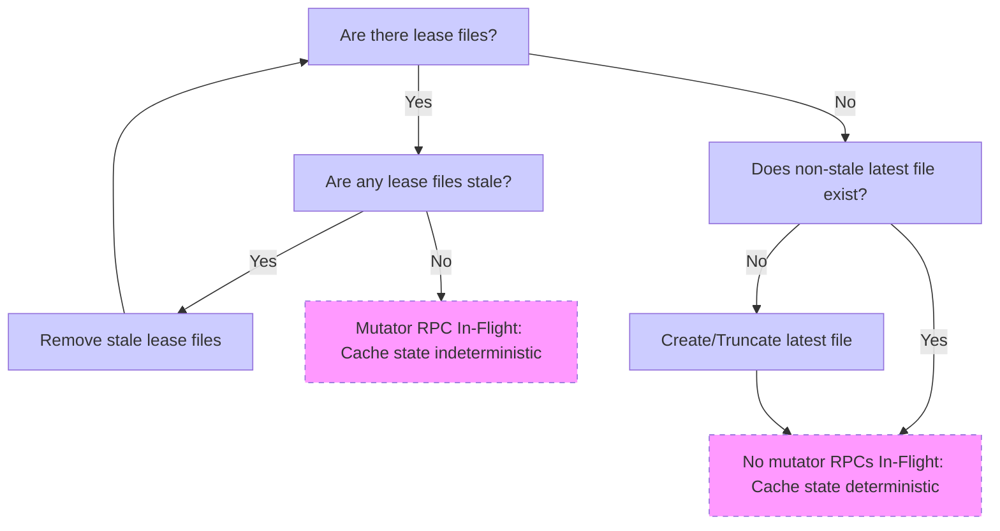

### Title
Missing staleness bound on Praefect's consistent-storages cache allows indefinitely stale read/write routing decisions - ([File: internal/praefect/datastore/storage_provider.go])

### Summary
The `CachingConsistentStoragesGetter` in `internal/praefect/datastore/storage_provider.go` caches the "up to date" storage set for each repository, but the cache entries have no expiry/staleness bound whatsoever. They are only invalidated by explicit PostgreSQL `LISTEN/NOTIFY` events. If any invalidation notification is ever lost, delayed, or fails to fire, the cached decision about which storages/replica are "consistent" is served forever with no fallback staleness check — directly analogous to the Chainlink `getPrice()` bug where `latestRoundData()` is trusted without checking `updatedAt`/`answeredInRound`.

### Finding Description
`NewCachingConsistentStoragesGetter` builds one LRU cache per virtual storage [1](#0-0) . Cache entries are added in `GetConsistentStorages` on every miss and returned directly on every hit with no timestamp or TTL check at all [2](#0-1) .

The only invalidation mechanism is `Notified`, which removes cache entries keyed by relative path when it receives and successfully decodes a Postgres notification payload [3](#0-2) . There is no secondary defense: no max-age check on any cache entry, no periodic revalidation, and no requirement that a `replicaInfoCache.Get` hit also be checked against a "last known good" timestamp before being trusted as authoritative for read/write distribution decisions. Compare this to other freshness-sensitive constructs elsewhere in the codebase that *do* enforce an explicit staleness window, e.g. the disk-cache walker's `staleAge` check [4](#0-3)  or the documented lease/latest-file staleness handling in the disk cache design [5](#0-4) . The `CachingConsistentStoragesGetter` has no equivalent bound.

The cache is disabled wholesale only when the whole Postgres connection drops (`Disconnected`) or when a notification payload fails to *parse* (`disableCaching` inside `Notified`) [6](#0-5) . But a single missed/never-delivered notification for one relative path (e.g., due to notification channel backpressure, a `pg_notify` payload exceeding Postgres' internal limits for a specific relative path batch, or any bug in the emitting trigger/query) is invisible to this global disable path — the specific stale entry for that repository will simply never be evicted and will be served as ground truth indefinitely.

### Impact Explanation
Praefect uses `GetConsistentStorages` to determine which storage nodes hold the latest generation of a repository for read distribution and consistency decisions. If a cache entry becomes stale (i.e., a replica set changed but the cache was not invalidated), Praefect can:
- Route reads to a storage node that no longer has the latest generation, silently serving outdated repository data (missing commits/refs) to a legitimate user's ordinary `git fetch`/read RPC after a normal push updated the repository elsewhere.
- Make routing/consistency decisions based on outdated replica membership, similar in spirit to a financial protocol using a stale price for margin calculations — here Gitaly uses a stale "which nodes are consistent" answer for data-serving decisions.

This is a data-integrity/staleness issue reachable purely through ordinary write-then-read sequences performed by unprivileged users; no malicious peer or leaked credential is required.

### Likelihood Explanation
The likelihood depends on how reliably Postgres notifications are delivered and processed by Praefect in production. Under normal conditions notifications are delivered promptly, so this is a latent design gap rather than an easily-triggerable exploit. However, unlike the disk cache and object-walker code elsewhere in the same repo, which explicitly build in staleness/TTL safety nets as defense-in-depth, this cache has *no* fallback bound at all, so any transient failure in the notification pipeline (connection hiccups processed asynchronously, notification channel deduplication/coalescing, or an unhandled edge case in the emitting trigger) results in permanently stale routing data for the affected repository until process restart.

### Recommendation
Add a bounded staleness/TTL check as defense-in-depth on top of the notification-based invalidation, e.g., track a "cached at" timestamp per `cachedReplicaInfo` entry and require `time.Since(cachedAt) < maxStaleness` before returning a cache hit in `GetConsistentStorages`, falling back to `c.csg.GetConsistentStorages` (and refreshing the entry) once the bound is exceeded — mirroring the `staleAge` pattern already used in `internal/cache/walker.go`. This ensures that a missed or delayed invalidation notification cannot cause indefinitely stale routing decisions.

### Proof of Concept
Conceptual reproduction (based on code inspection, not executed):
1. A repository `R` is written (pushed) on virtual storage `vs`, causing its replica set to change.
2. `GetConsistentStorages(ctx, "vs", "R")` is called and populates `cache.replicaInfoCache` with the pre-update replica set [7](#0-6) .
3. The database-side trigger/notification that should call `Notified` with `{"virtual_storage":"vs","relative_paths":["R"]}` fails to fire or is dropped (e.g., transient notify-channel issue).
4. All subsequent calls to `GetConsistentStorages(ctx, "vs", "R")` return the stale `replicaInfo` from cache indefinitely [8](#0-7) , since there is no expiry check — only an explicit `Remove` call from `Notified` can clear it.

### Citations

**File:** internal/praefect/datastore/storage_provider.go (L51-80)
```go
// NewCachingConsistentStoragesGetter returns a ConsistentStoragesGetter that uses caching.
func NewCachingConsistentStoragesGetter(logger log.Logger, csg ConsistentStoragesGetter, virtualStorages []string) (*CachingConsistentStoragesGetter, error) {
	cached := &CachingConsistentStoragesGetter{
		csg:            csg,
		caches:         make(map[string]*virtualStorageCache, len(virtualStorages)),
		callbackLogger: logger.WithField("component", "caching_storage_provider"),
		cacheAccessTotal: prometheus.NewCounterVec(
			prometheus.CounterOpts{
				Name: "gitaly_praefect_uptodate_storages_cache_access_total",
				Help: "Total number of cache access operations during defining of up to date storages for reads distribution (per virtual storage)",
			},
			[]string{"virtual_storage", "type"},
		),
	}

	for _, virtualStorage := range virtualStorages {
		replicaInfoCache, err := lru.NewWithEvict(2<<20, func(key string, value cachedReplicaInfo) {
			cached.cacheAccessTotal.WithLabelValues(virtualStorage, "evict").Inc()
		})
		if err != nil {
			return nil, err
		}
		cached.caches[virtualStorage] = &virtualStorageCache{
			syncer:           syncer{inflight: map[string]chan struct{}{}},
			replicaInfoCache: replicaInfoCache,
		}
	}

	return cached, nil
}
```

**File:** internal/praefect/datastore/storage_provider.go (L87-107)
```go
// Notified handles notifications by invalidating cache entries of updated repositories.
func (c *CachingConsistentStoragesGetter) Notified(n glsql.Notification) {
	var changes []notificationEntry
	if err := json.NewDecoder(strings.NewReader(n.Payload)).Decode(&changes); err != nil {
		c.disableCaching() // as we can't update cache properly we should disable it
		c.callbackLogger.WithError(err).WithField("channel", n.Channel).Error("received payload can't be processed, cache disabled")
		return
	}

	for _, entry := range changes {
		cache, found := c.caches[entry.VirtualStorage]
		if !found {
			c.callbackLogger.WithError(errNotExistingVirtualStorage).WithField("virtual_storage", entry.VirtualStorage).Error("cache not found")
			continue
		}

		for _, relativePath := range entry.RelativePaths {
			cache.replicaInfoCache.Remove(relativePath)
		}
	}
}
```

**File:** internal/praefect/datastore/storage_provider.go (L109-140)
```go
// Connected enables the cache when it has been connected to Postgres.
func (c *CachingConsistentStoragesGetter) Connected() {
	c.enableCaching() // (re-)enable cache usage
}

// Disconnected disables the caching when connection to Postgres has been lost.
func (c *CachingConsistentStoragesGetter) Disconnected(error) {
	// disable cache usage as it could be outdated
	c.disableCaching()
}

// Describe returns all metric descriptors.
func (c *CachingConsistentStoragesGetter) Describe(descs chan<- *prometheus.Desc) {
	prometheus.DescribeByCollect(c, descs)
}

// Collect collects all metrics.
func (c *CachingConsistentStoragesGetter) Collect(collector chan<- prometheus.Metric) {
	c.cacheAccessTotal.Collect(collector)
}

func (c *CachingConsistentStoragesGetter) enableCaching() {
	atomic.StoreInt32(&c.access, 1)
}

func (c *CachingConsistentStoragesGetter) disableCaching() {
	atomic.StoreInt32(&c.access, 0)

	for _, cache := range c.caches {
		cache.replicaInfoCache.Purge()
	}
}
```

**File:** internal/praefect/datastore/storage_provider.go (L146-184)
```go
// GetConsistentStorages returns the replica path and the set of up to date storages for the given repository keyed by virtual storage and relative path.
func (c *CachingConsistentStoragesGetter) GetConsistentStorages(ctx context.Context, virtualStorage, relativePath string) (string, *datastructure.Set[string], error) {
	cache, hasCache := c.caches[virtualStorage]
	if hasCache && c.isCacheEnabled() {
		if replicaInfo, found := cache.replicaInfoCache.Get(relativePath); found {
			c.cacheAccessTotal.WithLabelValues(virtualStorage, "hit").Inc()
			return replicaInfo.replicaPath, replicaInfo.storages, nil
		}

		// Synchronise concurrent attempts to update the cache for the same relative path.
		// This will cause us to wait for any ongoing calls, but also locks out other new
		// callers so that we can racelessly populate the cache. The deferred call will then
		// unlock other callers again once we're done with the lookup.
		defer cache.syncer.await(relativePath)()

		// We re-try whether the cache has been populated now via any concurrent Goroutine.
		// If so, we return the newly populated entry.
		if replicaInfo, found := cache.replicaInfoCache.Get(relativePath); found {
			c.cacheAccessTotal.WithLabelValues(virtualStorage, "hit").Inc()
			return replicaInfo.replicaPath, replicaInfo.storages, nil
		}
	} else {
		// Unset the cache so that we don't try to populate it when it is disabled.
		cache = nil
	}

	c.cacheAccessTotal.WithLabelValues(virtualStorage, "miss").Inc()

	replicaPath, storages, err := c.csg.GetConsistentStorages(ctx, virtualStorage, relativePath)
	if err != nil {
		return "", nil, err
	}
	if cache != nil {
		c.cacheAccessTotal.WithLabelValues(virtualStorage, "populate").Inc()
		cache.replicaInfoCache.Add(relativePath, cachedReplicaInfo{replicaPath: replicaPath, storages: storages})
	}

	return replicaPath, storages, err
}
```

**File:** internal/cache/walker.go (L62-65)
```go
		c.walkerCheckTotal.Inc()
		if time.Since(info.ModTime()) < staleAge {
			continue // still fresh
		}
```

**File:** doc/design_diskcache.md (L63-96)
```markdown
## Cache State Machine

The repository state files are used to determine whether the repository is in
a deterministic state (i.e. no mutating RPCs in-flight) and how to find the
valid cached responses for the current repository state. The state machine
diagram follows:



**Note:** There are momentary race conditions where an RPC may become in flight
between the time the lease files are checked and the latest file is inspected,
but this is allowed by the cache design in order to avoid distributed locking.
This means that a stale cached response might be served momentarily, but this
slight delay in fresh responses is a small tradeoff necessary to keep the cache
lockless. The lockless quality is highly desired since Gitaly is often operated on NFS
mounts where file locks are not advisable.
```
